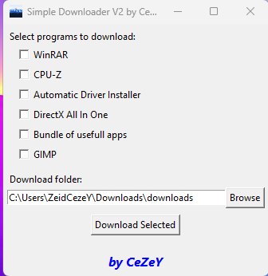

# Simple Downloader V2
This app downloads instantly the apps you choosen, for example winrar, directx, etc.

This one is made in python too, simple code, uses tkinter, requests etc, thread, simple python stuff
(THIS ISN'T THE SAME PROGRAM AS V3)

## ⚙️ Features
- Can download usefull apps (for people that made the windows for the first time is actually usefull)
- User can select where to download the apps
- User can download the following apps: WinRAR - CPU-Z - Automatic Driver Installer - DirectX All In One - Bundle of usefull apps (Ninite package) - GIMP

